# Production-Grade DevOps Pipeline for a Microservice on AWS

[](https://github.com/bradene0/devops-microservice/actions/workflows/ci.yml)
[](https://opensource.org/licenses/MIT)

### **Project Purpose**

This repository is a comprehensive, hands-on demonstration of a modern DevOps workflow. It is designed to showcase proficiency in **Cloud Engineering**, **Infrastructure as Code (IaC)**, **CI/CD Automation**, and **Containerization**. The project implements a production-grade pipeline that automatically builds, tests, secures, and deploys a Python Flask microservice to a scalable, serverless environment on AWS.

---

## 🏛️ Architecture & Design

This project follows cloud-native best practices to create a resilient, repeatable, and automated system.

### Architectural Diagram



### Workflow Overview

1.  **Code Commit**: A developer pushes new code to the `main` branch on GitHub.
2.  **CI Pipeline Trigger**: **GitHub Actions** automatically triggers the CI/CD workflow.
    * **Test & Scan**: The code is checked out, dependencies are installed, and automated tests (`Pytest`) and static security scans (`Bandit`) are executed.
    * **Build & Push**: If tests pass, a Docker image is built and pushed to a private **Amazon ECR** repository.
3.  **Continuous Deployment**:
    * The **Amazon ECS** service is configured to monitor the ECR repository.
    * Upon detecting a new image version, ECS initiates a zero-downtime rolling deployment on the **Fargate** cluster, replacing old tasks with new ones.
4.  **Service & Monitoring**:
    * The deployed containers run as serverless tasks on AWS Fargate.
    * An **Application Load Balancer (ALB)** securely exposes the service to the internet and distributes traffic.
    * **Amazon CloudWatch** collects logs and metrics for observability and monitoring.

### Key Architectural Decisions

* **Why AWS ECS Fargate?** Chosen for its serverless compute engine, which eliminates the need to provision and manage the underlying EC2 instances. This reduces operational overhead and allows for a focus on the application itself.
* **Why Terraform?** Selected as the IaC tool for its cloud-agnostic nature, declarative syntax, and strong community support. It enables the entire cloud infrastructure to be version-controlled, automated, and reliably reproduced.
* **Why GitHub Actions?** Used for its seamless integration with the source code repository, simplifying the setup of a powerful, event-driven CI/CD pipeline directly within GitHub.

---

## 💡 Skills Demonstrated

This project showcases a wide range of essential DevOps and Cloud Engineering skills:

* **Cloud Infrastructure (AWS)**: Proficient in provisioning and managing core AWS services, including **VPC**, Subnets, Security Groups, **IAM** Roles, **ECS**, **ECR**, **ALB**, and **CloudWatch**.
* **Infrastructure as Code (Terraform)**: Expertise in writing clean, modular, and reusable Terraform code to manage the full lifecycle of cloud infrastructure.
* **CI/CD Automation (GitHub Actions)**: Ability to design and implement multi-stage CI/CD pipelines that include automated testing, security scanning, artifact management (Docker images), and deployment triggers.
* **Containerization (Docker)**: Competency in writing efficient `Dockerfiles`, building images, and managing them in a container registry (ECR) for consistent application deployment.
* **DevSecOps Principles**: Integration of security directly into the pipeline (`Bandit` for SAST) and implementation of the principle of least privilege using granular **IAM** roles.
* **Python & Flask**: Foundational knowledge of building and testing a simple web application/API.

---

## Navigate This Repository

To see specific skills in action, please review the following files:

* **CI/CD Pipeline Definition**: `/.github/workflows/ci-cd.yml`
* **Infrastructure as Code**: `/terraform/` (especially `main.tf`, `vpc.tf`, and `ecs.tf`)
* **Application Code & Tests**: `/app/`
* **Container Definition**: `Dockerfile`

---

## 🚀 How to Run the Demo

These instructions allow you to deploy the entire project into your own AWS account.

### Prerequisites

* An **AWS Account** with programmatic access credentials.
* **AWS CLI**, **Terraform (`~> 1.0`)**, and **Docker** installed locally.
* A **GitHub Account** to fork this repository.

### Deployment Steps

1.  **Fork and Clone**: Fork this repository and clone it to your local machine.
2.  **Configure GitHub Secrets**: In your forked repository, go to `Settings > Secrets and variables > Actions` and add the following secrets to allow GitHub Actions to communicate with AWS:
    * `AWS_ACCESS_KEY_ID`
    * `AWS_SECRET_ACCESS_KEY`
    * `AWS_REGION` (e.g., `us-east-1`)
3.  **Deploy Infrastructure**: Navigate to the `terraform` directory and run:
    ```bash
    cd terraform
    terraform init
    terraform plan
    terraform apply --auto-approve
    ```
    Note the `alb_dns_name` output by Terraform.
4.  **Trigger Deployment**: Commit and push a change to your forked repository's `main` branch. This will trigger the GitHub Actions workflow.
    ```bash
    git commit --allow-empty -m "Trigger deployment" && git push
    ```
5.  **Verify Service**: After the pipeline completes, access the service using the ALB's DNS name:
    ```bash
    curl http://<your_alb_dns_name_here>
    # Expected output: {"message":"Hello, World!"}
    ```

### Teardown

To avoid costs, destroy all cloud resources when you are finished:
```bash
cd terraform
terraform destroy --auto-approve
```
---

## 📄 License

This project is licensed under the MIT License. See the [LICENSE](LICENSE) file for details.
